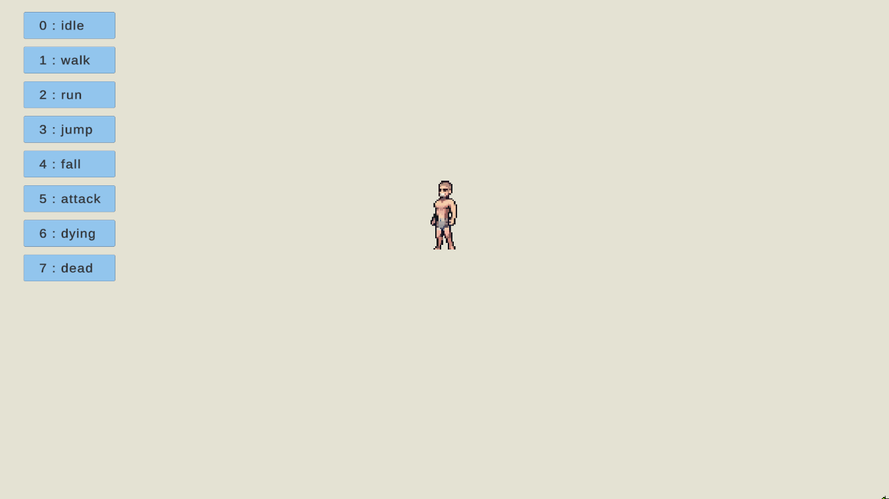
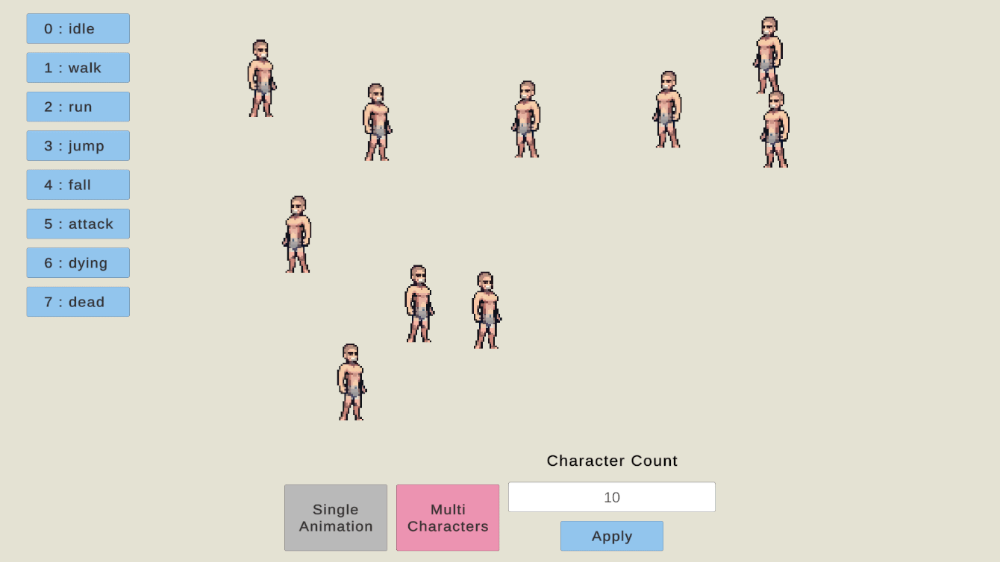
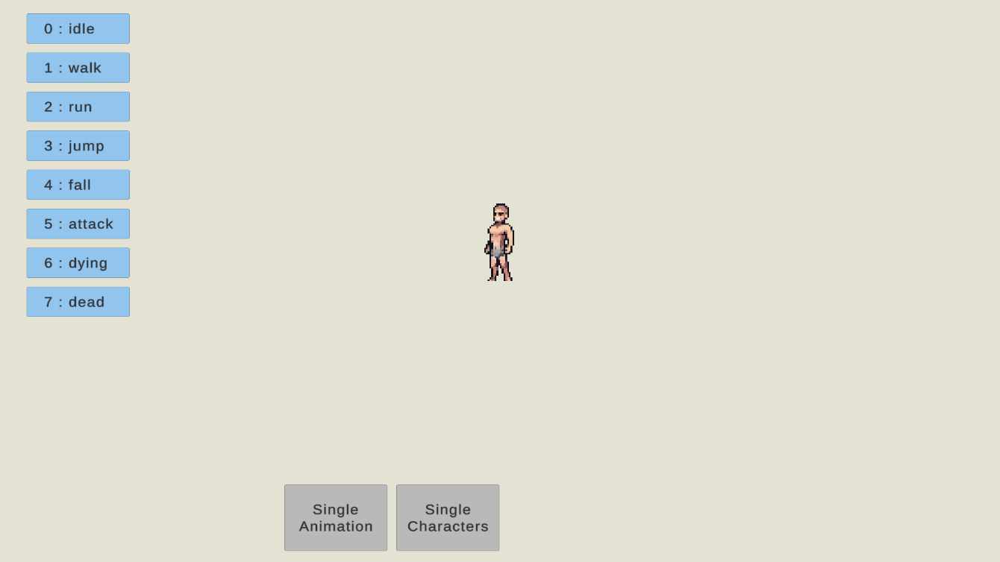
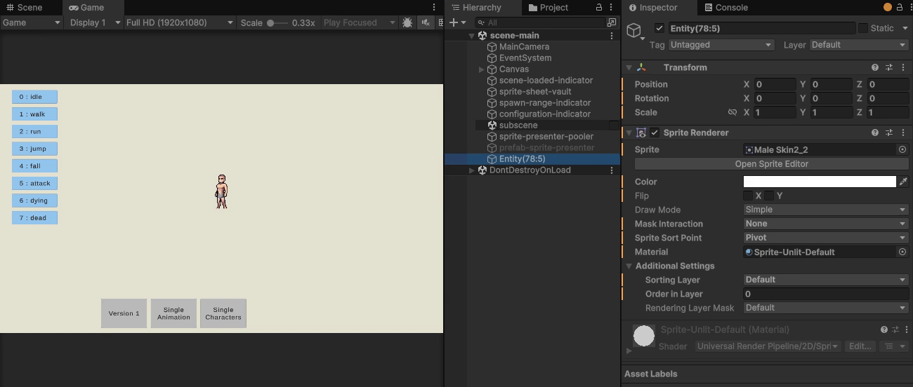

# Simple Setup for ECS 2D

This repo demonstrates an approach to Unity ECS in 2D that answers these questions:

- How to author and bake entity prefab for 2D character?
- How to store and use information of spritesheets globally?
- How to implement spritesheet animation logic in ECS?
- How to synchronize sprite renderers with entities?
- How to react to UI events in ECS?
- How to implement object-pool for sprite presenters?
- How to utilize [TransformAccessArray](https://docs.unity3d.com/ScriptReference/Jobs.TransformAccessArray.html)
to update the transform of sprite presenters in parallel?
- How to use Companion GameObject from Entities Hybrid?

## Changelog

### Version 3.0.0

Add more functionality

- Spawn multiple characters
- Randomly set the animation for each character
- Automatically move characters
- Can change global move speed for all characters in real-time
- Destroy entities

### Version 3.1.0

- Refactor some code
- Teleport characters to the opposite side of the screen if they went out of bounds

### Version 4.0.0

- Upgrade to Unity 6000.0.27
- Fix a compilation error caused by missing TMPro
- Add Entities Graphics and URP
- Add a "Version 2" button that switch to Companion GameObject powered by Entities Hybrid
- Make some changes to subscene and authoring to accomodate the Companion GameObject approach

#### About companion GameObjects

As in the video below, when "Version 1" is still active, the entities will use GameObjects
provided by the [GameObjectPool](/Assets/Code/Managed/GameObjectPool.cs).
Thus in the Hierarchy window, GameObjects represent entities will be active too.

When "Version 2" is activated, entities from version 1 will be destroyed and entities for
version 2 will be spawned. This time, they will use Compnanion GameObjects provided
by Entities Hybrid instead. Thus GameObjects on the Hierarchy window stay inactive.

**Note:** As of now, Companion GameObjects generally stay invisible. We don't have any
possible mean to directly inspect them.

### Version 4.0.1

- Correct subscene
- Remove the code to add `Prefab` tag to prefab entities at runtime

### Version 4.0.2

- Remove `[BurstCompile]` on some `ISystem` methods and document the reason.

### Version 4.0.3

- Remove redundant queries and code from some initialization systems.
- Utilize `Unity.Mathematics.Geometry.MinMaxAABB` for `WorldBoundary` component. (Thank @IAFahim)
- Add `OmitLinkedEntityGroupFromPrefabInstance` component to prefab entities to remove LinkedEntityGroup component from instance entities. Because the entities should be simple, without a hierarchy, the existence of LEG is unnecessary.
- Upgrade to Unity 6000.0.54

## Credits

- GandalfHardcore - Pixel Art Character Pack: https://gandalfhardcore.itch.io/free-pixel-art
